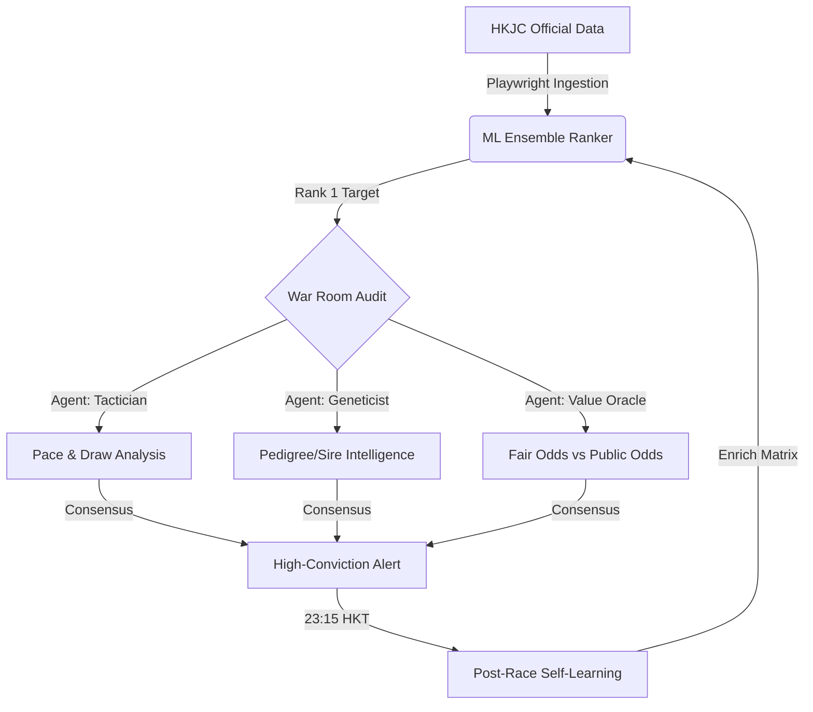

# Ultimate Engine v3 (Lunar Leap)

The **Ultimate Engine** is an industrial-grade, fully autonomous predictive powerhouse for Hong Kong Horse Racing (HKJC). Building on the statistical foundations of v2, the **Lunar Leap (v3)** upgrade transforms the system into a strategic "War Room" with real-time market arbitrage and pedigree-aware intelligence.

---

> [!IMPORTANT]
> **STRICT PROJECT ISOLATION: ULTIMATE ENGINE ONLY**  
> This environment is dedicated solely to the **Ultimate Engine v3 (Lunar Leap)**. It is technically and operationally decoupled from the legacy "hkjc" or "hkjc-v2" projects. No shared Firestore access, credentials, or cross-project contamination is permitted.

---

## 🏗️ System Architecture

The engine operates on a closed-loop, self-improving cycle:

---

## ?? Core Features (v3 Lunar Leap)

### 1. ?? DeepSeek-R1 "War Room"
Moving beyond pure statistics, every high-value pick is audited by a Multi-Agent simulation:
- **The Tactician**: Analyzes the race jump, pace configuration, and barrier draw traps.
- **The Geneticist**: Evaluates Sire/Dam lineage for surface and distance aptitude.
- **The Statistician**: Validates the ML ensemble confidence and "Unlucky Score" history.

### 2. ?? Value Gap Arbitrage
The engine computes **Fair Odds** based on win probabilities. If the public market (HKJC Odds) offers a significant premium over fair value, a **Grade S Value Alert** is triggered.

### 3. ?? Autonomous Post-Race Learning
Every night at 23:15 HKT, the engine automatically ingests official results to self-correct its mastery of the 82k+ feature matrix.

---

## ??? Resilience & Reliability

### ?? Soft Data Watchdog
Monitors HKJC daily for scratchings or jockey changes, triggering immediate re-calculation.

### ?? Lunar Heartbeat
A 30-minute self-healing watchdog that terminates hanging processes and restores connectivity automatically.

---

## ?? Operational Schedule (HKT)

| Time | Task | Objective |
| :--- | :--- | :--- |
| **Daily** | `soft_data_watchdog` | Scan for scratchings and changes. |
| **08:00 / 20:00** | `lunar_heartbeat` | Full system audit and self-healing. |
| **12:15** | `predict_today` | Generate high-conviction "War Room" Briefs. |
| **23:15** | `learn_today` | Ingest results and update the matrix. |

---

## ??? Deployment Summary
- **Stack**: Python 3.12, Playwright, DeepSeek-R1, Telegram Bot API.
- **Node**: Vultr Noble (Ubuntu 24.04).

**Certified for the April 6th Meeting.**

